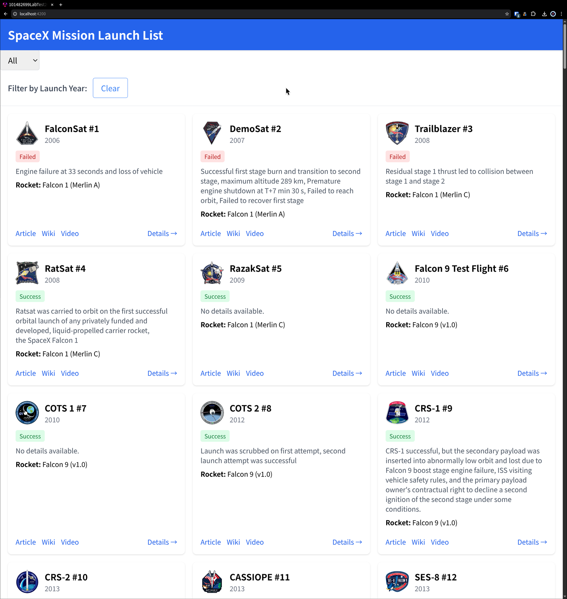
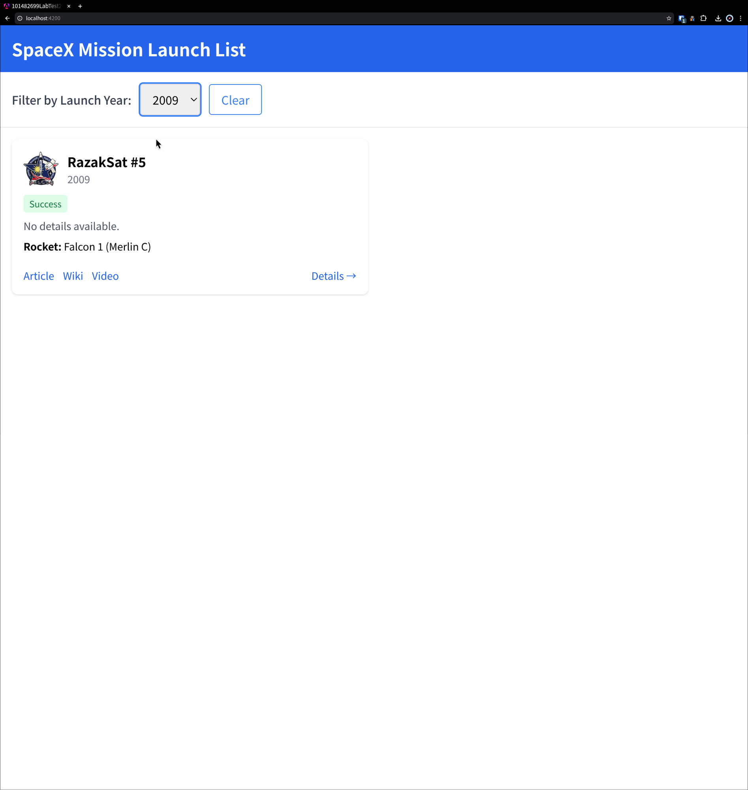
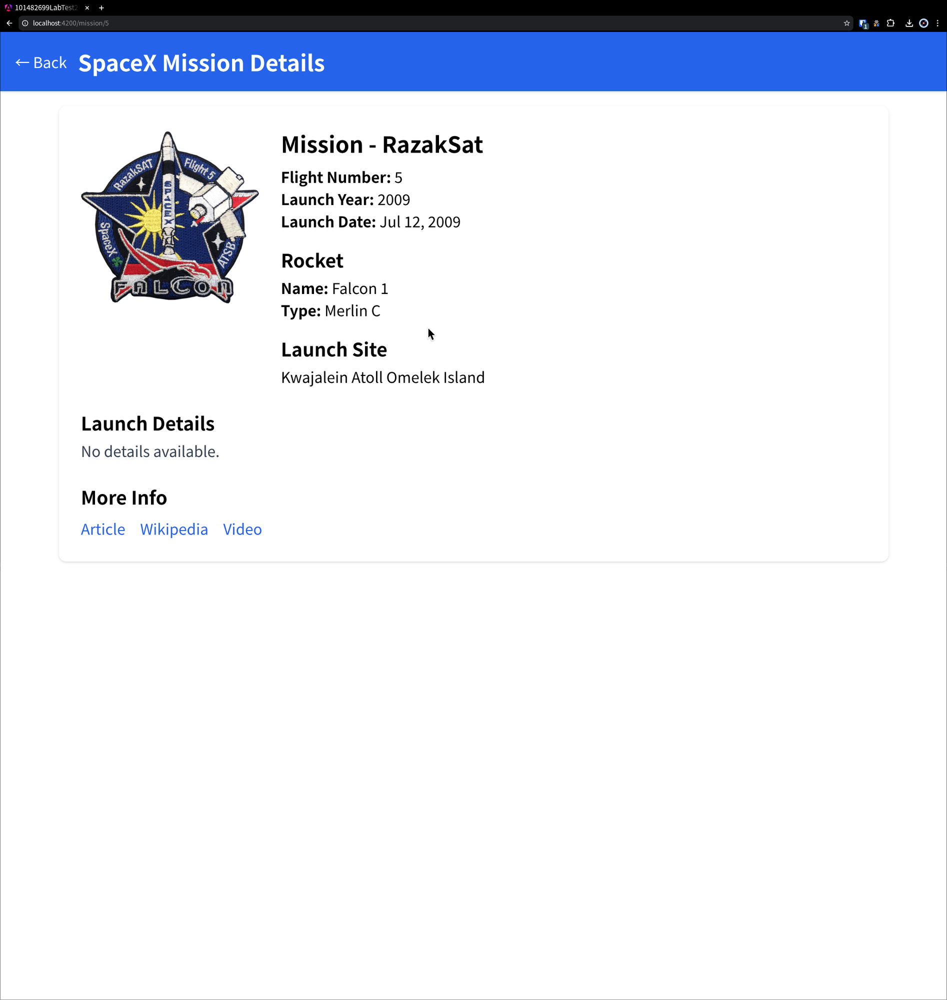

# SpaceX Mission Launch Explorer

COMP 3133 Lab Test 2 - Angular application that consumes the public SpaceX REST API to display mission launches.

## Description

An Angular 18 application that fetches SpaceX launch data from the public SpaceX API and displays it as a list of mission cards. Users can filter missions by launch year and click into a mission to see full details.

## Tech

- Angular 18 (standalone components, signals)
- Angular HttpClient for API calls
- ReactiveFormsModule for the year filter
- Tailwind CSS for styling
- SpaceX REST API v3 (`https://api.spacexdata.com/v3`)

## How to run

```bash
npm install
npm start
```

Then open `http://localhost:4200`.

## Build

```bash
npm run build
```

## Screenshots






